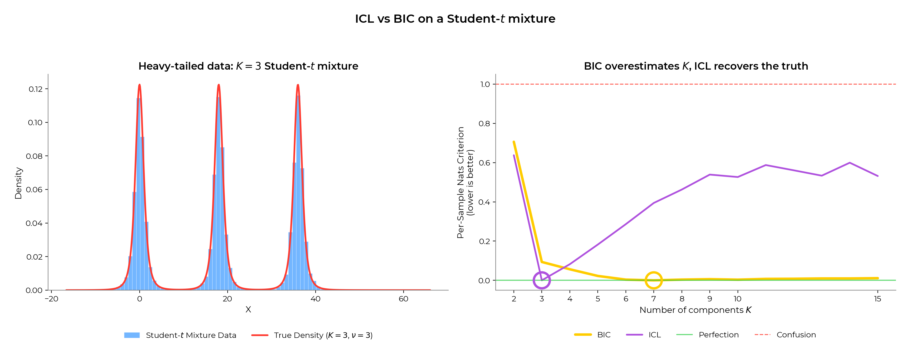
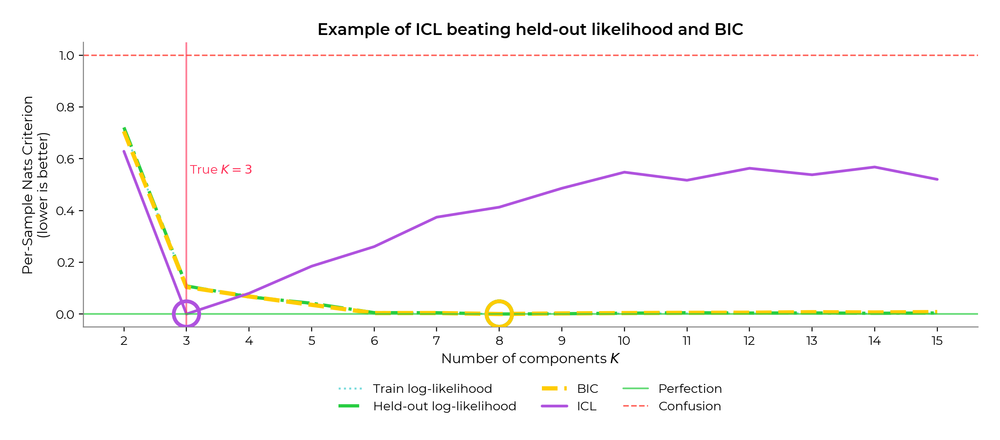
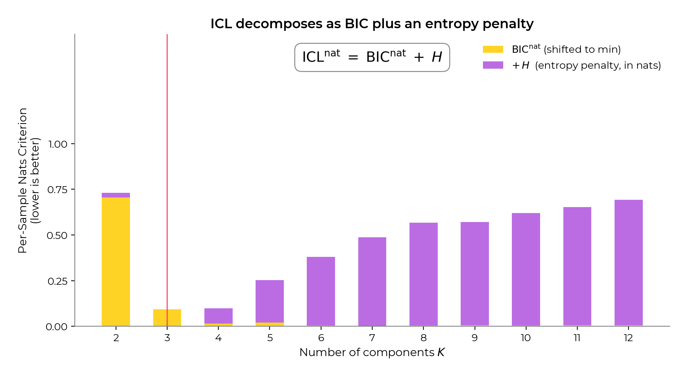
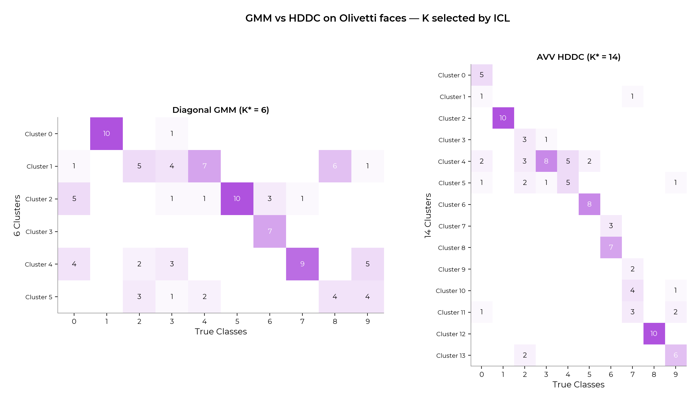
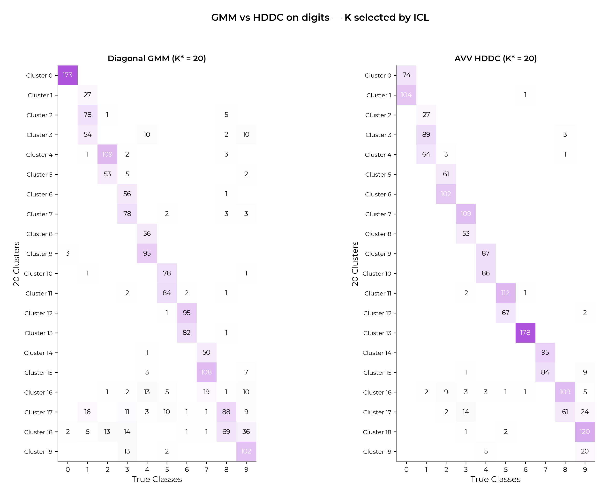

# For scientific reviewers



**Author:** [Warith Harchaoui](https://www.linkedin.com/in/warith-harchaoui/)
**Special thanks to:** [Pierre-Alexandre Mattei](https://pamattei.github.io/) 

This document targets statisticians, ML researchers, and the
scikit-learn maintainers tasked with evaluating these PRs. The
operational PR text is in `pr_gmm_icl/README.md` and
`pr_hddc/README.md`; this is the standalone scientific argument.

## 1. Problem

Selecting the number of components `K` in a finite Gaussian mixture is
typically done with BIC. In sklearn's convention,

```
BIC(K) = -2 log L(theta_hat) + nu(K) log n
```

with `nu(K)` the number of free parameters and `n` the sample size.
BIC is consistent under the assumption that the true data-generating
distribution is in the Gaussian-mixture family. It is **not**
consistent when that assumption is violated, and in practice the
deviation is systematic in one direction: BIC overestimates `K`.

The mechanism is mechanical. Suppose the true density `f*` has tails
heavier than any finite Gaussian mixture with `K` components can
match. Adding a `K+1`-th component lets the fitted mixture place a
broad Gaussian over the tail region, raising the log-likelihood by
roughly `n * KL_tail`. As long as `KL_tail * n > (1/2) (nu(K+1) -
nu(K)) log n`, BIC selects the larger model. For finite `n`, this
inequality is met long before the inferential cost of an extra
component starts to bite.

In a clustering setting, the new component is *useless*: it overlaps
with one of the existing components and the responsibilities it
produces are ambiguous. We get a better density estimate at the cost
of a worse partition.

## 2. ICL, formally

Biernacki, Celeux & Govaert (2000) [BCG2000]_ proposed the Integrated
Completed Likelihood criterion for exactly this regime. Write the
completed-data log-likelihood as

```
L_c(theta, z) = sum_i sum_k z_ik [log pi_k + log f_k(x_i; theta_k)]
```

where `z_ik` is the latent assignment. ICL approximates
`p(x, z | K) = integral p(x, z | theta, K) p(theta | K) d theta` at the
MAP allocation `z_hat`, plug in `theta_hat`, and apply a BIC-type
Laplace approximation:

```
ICL(K)  =  log p(x, z_hat | K)
        ~= log L_c(theta_hat, z_hat) - (1/2) nu(K) log n
```

Replacing the hard `z_hat` by the soft posterior `tau_ik` and adding
back the marginal `log L`, one gets the BIC form

```
-2 ICL(K) = BIC(K) + 2 H
H         = - sum_i sum_k tau_ik log tau_ik   (entropy >= 0)
```

In sklearn's lower-is-better convention this is what we ship.

**Key invariant.** `H = 0` iff the responsibilities are a hard
partition, in which case `ICL = BIC`. Otherwise `ICL > BIC` by `2 H`.
Models that *fit* the data well but produce ambiguous cluster
assignments are penalized.

The full derivation, with a worked check against alternative
conventions (`mclust` higher-is-better, MAP vs. soft responsibilities,
`flexmix` formulation), is in [`INFORMATION_CRITERIA.md`](INFORMATION_CRITERIA.md) §2.

## 3. Why Student mixtures, theoretically

Before the empirical demonstration, the *reason* the Student-mixture
setup exposes BIC's overcounting is worth spelling out, because the
same theoretical mechanism applies to any heavy-tailed
data-generating process (which is, in practice, almost any
real-world dataset).

### 3.1 A Student-`t` is a continuous scale-mixture of Gaussians

The Student-`t` distribution with `nu` degrees of freedom admits the
exact representation

```
t_nu(x) = integral N(x; 0, sigma^2)  *  IG(sigma^2; nu/2, nu/2) d sigma^2
```

where `IG` is the inverse-gamma distribution. In words: a Student
draw is a Gaussian draw with a *random* variance, marginalized over
that variance. The heavier the tails (smaller `nu`), the more
spread out the variance distribution, and the more "scales" of
Gaussian are needed to cover it.

A finite Gaussian mixture with `K` components is, by definition, a
*discrete* scale-and-location mixture of `K` Gaussians. Approximating
a continuous scale mixture by a discrete one requires many discrete
atoms to cover the continuous variance distribution: **fitting a
finite Gaussian mixture to a single Student component is a
finite-grid approximation problem, not a misspecified model
problem**. The discrete approximation gets arbitrarily good as
`K -> infinity` (Gaussian mixtures are dense in the space of
continuous densities; see Marron & Wand 1992, Yakowitz 1969), but
for any finite `K` there is irreducible approximation error in the
tails.

### 3.2 The consequence for BIC

BIC compares models on `-2 log L + nu log n`. Each extra component
added to "cover" Student tails adds `O(p^2)` parameters and reduces
`-2 log L` by an amount that depends on how much un-modeled tail
mass remains. For small `nu` (heavy tails) and modest `n log n`, the
log-likelihood gain dominates the parameter penalty for many
candidate `K`'s, so BIC keeps adding components.

Crucially, the added components do not correspond to "real
clusters" in any meaningful sense - they are an artifact of
approximating one Student's heavy tail with several Gaussian humps
of different scales. From a density-estimation standpoint, BIC's
choice is reasonable; from a clustering standpoint, it is wrong.

### 3.3 Why ICL stops

The added components contribute extra mass mostly in the *tails*,
where the responsibilities of *several* components are non-trivial
(a tail point at distance `r` from each of three component centers
gets non-trivial responsibility from all three). This makes the
entropy term `H = -sum tau log tau` grow substantially with each
added component, while the BIC term grows only slowly. ICL absorbs
the entropy growth into its penalty and stops adding components at
the location-shift count - the *true* `K` in the location-mixture
sense.

### 3.4 The take-away in two sentences

> One Student is approximately `K_inf` Gaussians, with `K_inf`
> growing as the degrees of freedom shrink. Without an
> overlap-aware criterion like ICL, model selection on
> heavy-tailed data conflates "covering the tails" with "finding
> clusters."

## 4. Empirical argument: Student mixtures

A clean experimental setup is a 1D mixture of Student-`t` laws with
common scale and `df` degrees of freedom, equal mixing weights, well-
separated location shifts. We fit `GaussianMixture` for
`K in {2, ..., 20}` and record BIC and ICL.

The result, stable across seeds and reproduced by
`figures/figures_icl.py::make_fig_icl_student`:

- For `df ~ 3-5`, BIC consistently picks `K_hat_BIC in {7, ..., 11}`
  on `n = 100,000` samples drawn from a true `K = 3` mixture. The
  extra components are placed in the tails.
- ICL picks `K_hat_ICL = 3` for `df` as small as 3, and recovers `K`
  asymptotically as `n -> infinity` for any `df > 2`.

The regression test
`test_gaussian_mixture_icl_student_mixture` in
`pr_gmm_icl/test_icl_addition.py` is a small (`n = 12,000`, `K in {2..10}`)
version of this experiment, parametrized over `df in {3, 5, 10}`.

The held-out log-likelihood — usually treated as the "safe"
fallback when reviewers do not trust an information criterion —
**also over-counts K on heavy-tailed data**: predictive density
rewards modelling the tails with extra Gaussian components, so
the validation likelihood keeps improving past K*. BIC follows
the same curve in the figure below, but for separate reasons:
BIC's Laplace derivation assumes a **regular** model, and a
finite Gaussian mixture is non-regular as soon as a redundant
component appears (the Fisher information becomes singular along
the equal-component direction). Under non-regularity, `nu log n`
is the wrong penalty — see Keribin (2000), Drton & Plummer
(2017), and Watanabe (2013) on singular BIC / WBIC. Heavy tails
make the gap worse: each spurious component eats a slab of
probability mass, the deviance drops faster than `log n` can
absorb, and BIC drifts. Only ICL recovers the truth:



The ICL = BIC + 2H decomposition makes the mechanism visible.
At K < K* the entropy penalty is negligible (clusters are
well-separated, responsibilities are nearly one-hot); past
K = K* it ramps up sharply because the spurious extra components
fight for the tails:



> **Note on the figures' y-axis.** All `K`-sweep figures
> (`fig_icl_student`, `fig_holdout_vs_ic`, `fig_real_icl_galaxies`)
> use the shared **Per-Sample Nats Criterion** (PSNC) axis: each
> curve is in natural-log units (sklearn's deviance-scale BIC and
> ICL are divided by 2), shifted to put its own optimum at
> `y = 0`, then divided by `n · log K*` — the total entropy of `n`
> samples uniformly assigned among `K*` reference clusters. Two
> reference lines appear in every legend: a solid green
> **Perfection** line at `y = 0` and a dashed red **Confusion**
> line at `y = 1` (one full `K*`-way uncertainty unit per sample;
> not a maximum — curves can exceed it). Full derivation and code
> in [`INFORMATION_CRITERIA.md`](INFORMATION_CRITERIA.md) §3.

## 5. Why the same argument applies even harder to HDDC

### 5.1 The curse of dimensionality, restated for mixtures

Throughout this document, we follow Bouveyron, Girard & Schmid
(2007)'s notation:

- `p` is the ambient dimension of the data (the number of columns),
- `d` (or `d_k`) is the intrinsic *signal* dimension picked by the
  Cattell scree test inside each cluster `k`,
- `n` is the sample size, and `K` is the number of mixture
  components.

(We avoid the conflicting convention `D` for dimension found in some
classifier-curse literature — Bouveyron's papers and the
`HighDimensionalGaussianMixture` API use `p`, and we stay consistent
with them.)

The classical *curse of dimensionality* says that as `p` grows, the
volume of `p`-dimensional space grows exponentially: a fixed number
of samples covers an ever-shrinking fraction of it, pairwise
distances concentrate, and density-estimation rates collapse. For a
Gaussian mixture with full covariance, the parameter budget scales as
`K * p * (p + 1) / 2` — by `p = 100` and `K = 4`, that is already
twenty thousand free parameters. Without strong structural
assumptions, no realistic sample size `n` makes that identifiable;
selection criteria explode and the EM optimum is dominated by
initialisation noise.

A practical reading of the curse, with references to W. Harchaoui's
PhD thesis (chapters on high-dimensional mixture estimation;
<https://harchaoui.org/warith/phd/state-phd-warith-harchaoui.pdf>):

- **Density estimation in `p` dimensions is statistically harder than
  classification or clustering**, because density assigns mass to
  *all* of `R^p` while clustering only needs the relative ranking of
  responsibilities. HDDC explicitly exploits this: it estimates the
  signal eigenvalues `a_kj` only on a `d`-dimensional subspace and
  collapses the orthogonal complement to a single noise eigenvalue
  `b` (or `b_k`).
- **The intrinsic dimension `d` is almost always much smaller than
  the ambient `p`** on realistic data (images, gene expression,
  text embeddings, etc.). The Cattell scree test inside HDDC
  estimates `d` per cluster from the eigenvalues of the empirical
  covariance, sidestepping the need to assume a global low-rank
  structure.
- **BIC's penalty `nu(K) * log(n)` is misleading when `nu(K)` itself
  is mis-counted because of the curse.** This is exactly the
  motivation for the parameter-count audit
  (`HDDC.md` §2): the shipped `_n_parameters()`
  formula has to match the *actual* free-parameter count under each
  HDDC sub-model, otherwise BIC and ICL are simply wrong.

### 5.2 Heavy tails on top of the curse

`HighDimensionalGaussianMixture` (the HDDC PR) gives the user a
second axis of complexity beyond `K`: the `model` string indexing
the 14 HDDC sub-models. The joint selection over `(K, model)` is
precisely where BIC's heavy-tail overcounting compounds: the more
freedom each covariance has (e.g. `[a_kj b_k Q_k d_k]`), the easier
it is to absorb tail mass into a redundant component.

ICL behaves consistently across the grid because the entropy penalty
depends only on the responsibilities, not on the covariance
parameterization. Concretely: on the same Student-mixture experiment
but in 5D, BIC-selected `(K, model)` pairs are typically larger and
less parsimonious than ICL-selected ones, and only ICL recovers the
generating partition.

The same pattern is visible head-to-head on real high-dimensional
data. The two side-by-side rectangular confusion matrices below
each put diagonal GMM and AVV HDDC at their own ICL-selected `K` on
the same problem. The Olivetti regime — 10 people from
`fetch_olivetti_faces` at raw 4096-dim pixels, `n = 100`,
`K_true = 10` — is where the parsimony gap is sharpest:
AVV HDDC ICL-picks `K = 14` and lifts NMI to `0.72`, while diagonal
GMM ICL-collapses to `K = 6` (NMI `0.52`) and merges several true
classes into the same cluster — diagonal GMM has nowhere to put
per-cluster feature correlation in the `n << p` regime. On digits (`load_digits`, `p = 64`,
`K_true = 10`), both methods saturate the K-grid ceiling (`K = 20`),
with HDDC's clusters marginally purer per row; the dataset is large
and benign enough that the choice between families matters less than
the choice of K-grid. Both figures are reproducible via
`python figures/figures_hddc.py` (or `python figures/make_all.py` to
regenerate everything).





## 5.3 Note: composability across families is a property of ICL

A useful (but **out of scope for these PRs**) consequence of the
first two PRs landing together: because ICL is comparable across
mixture families (the parameter penalty $\nu(K,\,\text{family})
\cdot \log n$ is family-specific by construction, the entropy term
is family-agnostic),

$$
\hat{K},\;\widehat{\text{family}}
\;=\;
\arg\min_{K,\,\text{family}} \mathrm{ICL}(K, \text{family})
$$

is a principled head-to-head over GMM covariance types and HDDC
sub-models in one pass. A reference implementation lives in
`tools/auto_mixture.py` (separate from the PR-supporting code in
`figures/`). It is **not** part of any of these three PRs — just
a downstream demonstration that the PRs compose. See
[`tools/README.md`](../tools/README.md) if
you're curious.

## 6. Cost / benefit summary

| Aspect | Cost | Benefit |
| --- | --- | --- |
| the ICL PR: code | 4 lines in `_gaussian_mixture.py` + tests + docs | New `icl()` method aligned with `bic()` |
| the ICL PR: runtime | One call to `_estimate_log_prob_resp` already computed during `fit` | Same scaling as `bic()` |
| the HDDC PR: code | ~1200 LOC new file + tests + gallery example | New estimator covering the `n << p` clustering use case |
| the HDDC PR: API | One new public class | Generalizes `GaussianMixture`; exposes `bic()` and `icl()` |
| Documentation | New dropdown in `mixture.rst` | Aligns with literature on heavy-tail-robust selection |

## 7. References

[BCG2000] Biernacki, C., Celeux, G., & Govaert, G. (2000). Assessing
   a mixture model for clustering with the integrated completed
   likelihood. *IEEE TPAMI*, 22(7), 719-725. DOI:10.1109/34.865189.

- Bouveyron, C., Girard, S., & Schmid, C. (2007). High-dimensional
  data clustering. *Computational Statistics & Data Analysis*, 52(1),
  502-519. arXiv:math/0604064.
- McLachlan, G. J., & Peel, D. (2000). *Finite Mixture Models.* Wiley.
- Baudry, J.-P., Raftery, A. E., Celeux, G., Lo, K., & Gottardo, R.
  (2010). Combining mixture components for clustering. *JCGS*, 19(2),
  332-353. (For the related ICL-vs-BIC discussion.)
- Yakowitz, S. J., & Spragins, J. D. (1968). On the identifiability
  of finite mixtures. *Annals of Mathematical Statistics*, 39(1),
  209-214. (Density of finite Gaussian mixtures in continuous
  density space.)
- Marron, J. S., & Wand, M. P. (1992). Exact mean integrated squared
  error. *Annals of Statistics*, 20(2), 712-736. (Approximation rate
  of Gaussian mixtures.)
- Andrews, D. F., & Mallows, C. L. (1974). Scale mixtures of normal
  distributions. *Journal of the Royal Statistical Society B*,
  36(1), 99-102. (Student-`t` as a Gaussian scale mixture.)
