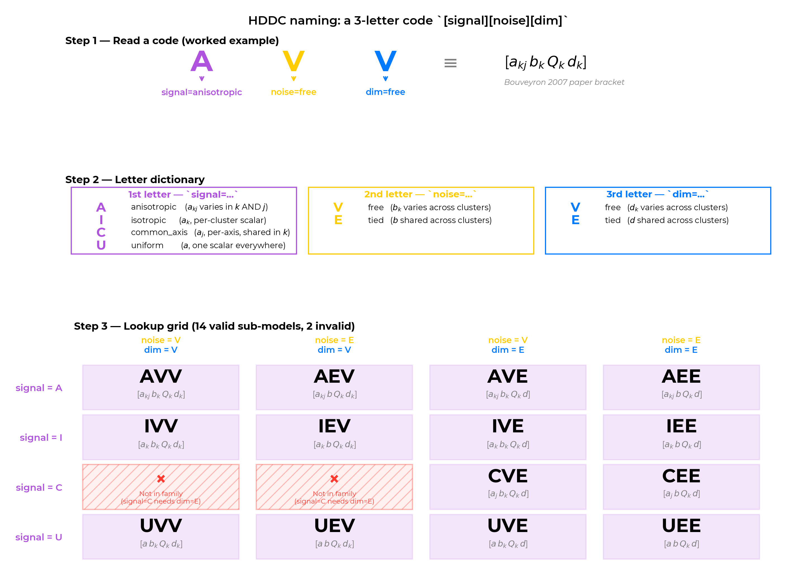
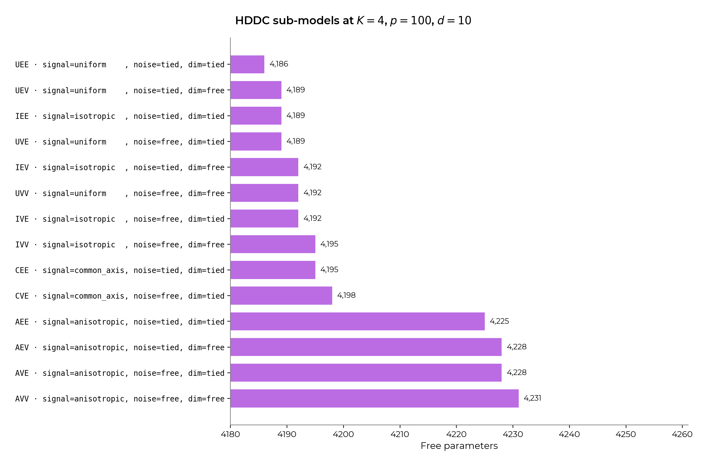

# HDDC reference

**Author:** [Warith Harchaoui](https://www.linkedin.com/in/warith-harchaoui/)
**Special thanks to:** [Pierre-Alexandre Mattei](https://pamattei.github.io/)

This document consolidates everything HDDC-specific that a reviewer
or implementer needs to verify the contribution: the three accepted
ways to name a sub-model, the per-row parameter count against
Bouveyron 2007 Table 1, and the Cattell scree rule HDDC uses to pick
each cluster's signal dimension `d_k`.

- [1. Naming the HDDC sub-models](#1-naming-the-hddc-sub-models)
- [2. Parameter count audit (Bouveyron Table 1)](#2-parameter-count-audit-bouveyron-table-1)
- [3. The Cattell scree rule for `d_k` (HDclassif-aligned)](#3-the-cattell-scree-rule-for-d_k-hdclassif-aligned)

## 1. Naming the HDDC sub-models

HDDC has several namings across its implementation in R, in articles,
etc. This section proposes 3 alternative naming schemes (2 used in
previous works and 1 new one), compares them on five criteria, and
recommends one — while remaining open to the maintainers' verdict.



The choice matters: the `model=` argument is the most visible part of
the HDDC public API. A good name is searchable in docs, reads aloud
without losing meaning, and gives the user intuition before they read
the docstring. A bad name turns the parameter into a magic string and
shifts every user to the default.

### 1.1 The four axes of an HDDC sub-model

Every sub-model in the family `[a_kj b_k Q_k d_k]` is defined by four
constraint axes. Subspace orientation (`Q_k` vs `Q`) is fixed at free
per cluster in our 14-model subset; the remaining axes vary as:

| Axis | Levels | Geometric meaning |
| --- | --- | --- |
| **Signal eigenvalues** (`a_*`) | `a_kj` / `a_k` / `a_j` / `a` | shape of each cluster's signal ellipsoid |
| **Noise variance** (`b_*`) | `b_k` / `b` | volume of each cluster's orthogonal "halo" |
| **Signal dimension** (`d_*`) | `d_k` / `d` | width of each cluster's intrinsic subspace |

Signal eigenvalues have four levels (the most expressive axis):
`a_kj` (per cluster, per axis), `a_k` (per cluster, isotropic),
`a_j` (per axis, shared across clusters), `a` (single scalar). Noise
and dim have two levels each. Total: 4 x 2 x 2 = 16, minus two
forbidden cells (`a_j` per-axis requires a common `d`), giving 14.

### 1.2 Three candidate naming schemes

The three schemes are referred to by short names throughout this
document and throughout the docstrings:

- **Paper bracket** — `model="akj_bk_Qk_dk"` (faithful to Bouveyron 2007)
- **Geometric code** — `model="AVV"` (3-letter `<Signal><Noise><Dim>`)
- **Per-axis kwargs** — `signal=…, noise=…, dim=…` (English-readable)

#### Paper bracket — `model="akj_bk_Qk_dk"`

```python
HighDimensionalGaussianMixture(model="akj_bk_Qk_dk")
HighDimensionalGaussianMixture(model="a_b_Qk_d")
```

| Pros | Cons |
| --- | --- |
| Direct citation of the paper - Researchers recognize it on sight | Cryptic to first-time sklearn users |
| Unambiguous, no risk of mistranslation | The trailing `Qk` is redundant (always present in our subset) |
| Already used by R's `HDclassif` | `kj` reads weirdly in Python; some users will write `jk` |
| | The 14 strings differ by 1-2 characters; copy-paste typos are silent |

#### Geometric code — `model="AVV"`

Inspired by `mclust`'s well-known `EII / VII / EEI / ... / VVV`
scheme. Three letters, one per axis: `<Signal><Noise><Dim>`.

| Letter | Signal axis | Noise axis | Dim axis |
| --- | --- | --- | --- |
| `A` | Anisotropic (`a_kj`) | --- | --- |
| `I` | Isotropic per cluster (`a_k`) | --- | --- |
| `C` | Common axis across clusters (`a_j`) | --- | --- |
| `U` | Uniform scalar (`a`) | --- | --- |
| `V` | --- | **V**arying per cluster (`b_k`) | **V**arying per cluster (`d_k`) |
| `E` | --- | **E**qual / tied across clusters (`b`) | **E**qual / tied (`d`) |

The 14 codes (using mclust-familiar `V`/`E` spelling for the binary axes):

| Paper notation | Geometric code | Plain reading |
| --- | --- | --- |
| `[a_kj b_k Q_k d_k]` | `AVV` | Anisotropic, varying noise, varying dim |
| `[a_kj b Q_k d_k]`   | `AEV` | Anisotropic, equal noise, varying dim |
| `[a_k b_k Q_k d_k]`  | `IVV` | Isotropic, varying noise, varying dim |
| `[a_k b Q_k d_k]`    | `IEV` | Isotropic, equal noise, varying dim |
| `[a b_k Q_k d_k]`    | `UVV` | Uniform, varying noise, varying dim |
| `[a b Q_k d_k]`      | `UEV` | Uniform, equal noise, varying dim |
| `[a_kj b_k Q_k d]`   | `AVE` | Anisotropic, varying noise, equal dim |
| `[a_j b_k Q_k d]`    | `CVE` | Common-axis, varying noise, equal dim |
| `[a_kj b Q_k d]`     | `AEE` | Anisotropic, equal noise, equal dim |
| `[a_j b Q_k d]`      | `CEE` | Common-axis, equal noise, equal dim |
| `[a_k b_k Q_k d]`    | `IVE` | Isotropic, varying noise, equal dim |
| `[a_k b Q_k d]`      | `IEE` | Isotropic, equal noise, equal dim |
| `[a b_k Q_k d]`      | `UVE` | Uniform, varying noise, equal dim |
| `[a b Q_k d]`        | `UEE` | Uniform, equal noise, equal dim |

```python
HighDimensionalGaussianMixture(model="AVV")    # most general
HighDimensionalGaussianMixture(model="UEE")    # most constrained
```

> **About the `V`/`E` letters and mclust.** mclust uses the same
> letters for its own (full-rank) covariance family: `EII`, `VVV` and
> so on. We borrow only the spelling convention - `V` for varying
> across clusters, `E` for equal across clusters - because mclust
> users already know it. We do **not** alias mclust codes onto HDDC
> codes, because the model families are mathematically different:
> mclust's `VVV` is a full-rank Gaussian per cluster, HDDC's `AVV` is
> a rank-`d_k` Gaussian per cluster. Submitting `model="VVV"` raises
> a `ValueError` with a pointer to the HDDC table above. See section
> *Why not alias mclust codes directly* below.

| Pros | Cons |
| --- | --- |
| One letter per axis - axis intent is unambiguous | Still requires a lookup the first time |
| Easy to enumerate (`for m in "AICU" for n in "VE" for d in "VE"`) | New convention, not yet in any package |
| Pronounceable: "A-V-V", "U-E-E" | Two combinations (`CVV`, `CEV`) are absent - need a doc note |
| `V`/`E` spelling matches mclust convention | Visual similarity to mclust codes (`VVV`, `EII`) may invite misreading - we reject mclust codes with a friendly error |

#### Per-axis kwargs — `signal=…, noise=…, dim=…`

Drop `model=` and use three separate keyword arguments.

```python
HighDimensionalGaussianMixture(
    signal="anisotropic",   # or "isotropic", "common_axis", "uniform"
    noise="varying",        # or "equal"
    dim="varying",          # or "equal"
)
```

| Pros | Cons |
| --- | --- |
| Maximum readability - reads like English | More typing |
| Each argument has its own docstring | Harder to grid-search; need `itertools.product` over three lists |
| Validation messages can be targeted ("invalid `signal=...`") | Departs from `covariance_type=` precedent in `GaussianMixture` |
| Extends naturally if a new axis (e.g. `orientation`) is added | Three knobs in the constructor instead of one |

### 1.3 Comparison on five criteria

| Criterion | Paper bracket | Geometric code | Per-axis kwargs |
| --- | --- | --- | --- |
| **Research literature continuity** | best | medium | low (need translation table) |
| **Self-explanatory at a glance** | low | medium | best |
| **Typo resistance** | low | medium | best |
| **Consistency with sklearn precedent** (`covariance_type=`) | medium | medium | low |
| **Grid-searchable** | best | best | medium |

### 1.4 Recommendation (revised after user input)

Ship **all three schemes** under a **strict no-conflict contract**:
multiple spellings are accepted, but they must agree wherever they
overlap. Silent overrides are forbidden; mismatches raise a
`ValueError` with a precise message.

#### Resolution contract

| What you pass | What happens |
| --- | --- |
| `model="AVV"` (alone) | Resolves to `AVV` |
| `model="akj_bk_Qk_dk"` (alone) | Aliases to `AVV` |
| `signal=..., noise=..., dim=...` (all three, no `model=`) | Resolves to the implied code |
| `model="AVV", noise="varying"` (kwarg AGREES with model axis) | Resolves to `AVV`; kwarg is redundant but legal |
| `model="AVV", noise="equal"` (kwarg DISAGREES with model axis) | **ValueError** - "model='AVV' has noise='varying' but noise='equal' was also passed; pick one." |
| `model="VVV"` (mclust code) | **ValueError** - HDDC and mclust families differ; pointer to HDDC table |

To override one axis from a named model, write the resulting code
directly (`model="AVE"` instead of `model="AVV", dim="equal"`), or
drop `model=` and specify all three kwargs. This costs three more
characters of typing in exchange for catching mistakes at the call
site.

#### Ablation / parameter-sweep patterns

For sweeps you typically want to vary one axis at a time. The
strict-mode-clean way:

```python
# Option 1: enumerate by axis, no model= (cleanest)
for noise in ("varying", "equal"):
    for dim in ("varying", "equal"):
        hgmm = HighDimensionalGaussianMixture(
            n_components=K,
            signal="anisotropic",
            noise=noise,
            dim=dim,
        ).fit(X)

# Option 2: enumerate model codes directly
for m in ("AVV", "AEV", "AVE", "AEE"):
    hgmm = HighDimensionalGaussianMixture(
        n_components=K, model=m,
    ).fit(X)
```

We deliberately do *not* offer a hybrid (`model="AVV", dim="equal"`)
because experience with similar APIs (e.g. matplotlib's `style=` +
explicit kwargs) shows the override semantics are the leading source
of "why didn't my override apply?" bug reports. Strict mode is the
sklearn-idiomatic choice (see e.g. how `train_test_split` rejects
conflicting `test_size` + `train_size`).

#### Canonical internal form

Pick the **geometric code** as the canonical key used inside
`_n_parameters`, error messages, and serialization. It is the
shortest, the most user-readable, and translates losslessly to either
of the other two spellings.

#### Constructor signature (full)

```python
class HighDimensionalGaussianMixture(ClusterMixin, BaseEstimator):
    def __init__(
        self,
        n_components=1,
        *,
        # ----- model family (strict no-conflict semantics) -----
        model="AVV",                     # AVV / akj_bk_Qk_dk
        signal=None,                     # "anisotropic" / "isotropic"
                                         #   / "common_axis" / "uniform"
        noise=None,                      # "varying" / "equal"
        dim=None,                        # "varying" / "equal"
        # ----- intrinsic-dimensionality selection -----
        cattell_threshold=0.5,           # see section 3 below
        signal_dim=None,                 # force d_k = signal_dim
                                         #   (only meaningful when model
                                         #    has 'equal' dim, i.e. ends
                                         #    in E)
        # ----- EM controls -----
        tol=1e-3, max_iter=300, n_init=10,
        init_params="kmeans",
        min_cluster_size=5,
        random_state=None, verbose=False,
    ):
        ...
```

`cattell_threshold` defaults to `0.5` (`HDclassif` itself ships `0.2`,
which is much more aggressive). The full rationale and four-variant
comparison live in section 3 below; the short version is that this is
not a noise-knob — it changes `d_k`, which changes `_n_parameters`,
which changes BIC and ICL.

`signal_dim` is the explicit-override knob for `d_k`. It is honored
only on the `equal`-dim sub-models (codes ending in `E`); setting it
on a `varying`-dim model (`*V`) is silently ignored, since `d_k` is
re-estimated per cluster in that case. If you want to force `d_k = d`
on every cluster, choose an `equal`-dim model (`AVE`, `AEE`, ...) and
set `signal_dim=d`.

Resolution lives in `_resolve_model()`, called once at the top of
`fit()`. After resolution, the canonical key is stored on
`self._geometric_model_` (trailing underscore signals "fitted
attribute") so the rest of the code never has to branch on input
form.

#### Sketch of the resolver

```python
_SIGNAL = {"anisotropic": "A", "isotropic": "I",
           "common_axis": "C", "uniform": "U"}
_NOISE  = {"varying": "V", "equal": "E"}
_DIM    = {"varying": "V", "equal": "E"}

_PAPER_TO_GEOMETRIC = {
    "akj_bk_Qk_dk": "AVV",  "akj_b_Qk_dk": "AEV",
    "ak_bk_Qk_dk":  "IVV",  "ak_b_Qk_dk":  "IEV",
    "a_bk_Qk_dk":   "UVV",  "a_b_Qk_dk":   "UEV",
    "akj_bk_Qk_d":  "AVE",  "aj_bk_Qk_d":  "CVE",
    "akj_b_Qk_d":   "AEE",  "aj_b_Qk_d":   "CEE",
    "ak_bk_Qk_d":   "IVE",  "ak_b_Qk_d":   "IEE",
    "a_bk_Qk_d":    "UVE",  "a_b_Qk_d":    "UEE",
}

_VALID_GEOMETRIC = set(_PAPER_TO_GEOMETRIC.values())

# Codes that look HDDC-like but are actually mclust. Reject explicitly
# with a friendly error so the user understands the families differ.
_MCLUST_CONFUSABLES = {
    "EII", "VII", "EEI", "VEI", "EVI", "VVI",
    "EEE", "VEE", "EVE", "VVE", "EEV", "VEV", "EVV", "VVV",
} - _VALID_GEOMETRIC

def _resolve_model(self):
    """Resolve (model, signal, noise, dim) into a single geometric code.

    Strict semantics: when both `model=` and per-axis kwargs are set,
    they must agree on every axis they both specify; otherwise raise.
    No silent override.
    """
    has_model = self.model is not None
    has_kwargs = any(v is not None
                     for v in (self.signal, self.noise, self.dim))

    if not has_model and not has_kwargs:
        raise ValueError("Either `model=` or all three axis kwargs "
                         "(`signal`, `noise`, `dim`) must be set.")

    # Pure per-axis kwargs: kwargs only.
    if has_kwargs and not has_model:
        if any(v is None for v in (self.signal, self.noise, self.dim)):
            missing = [name for name, v in (
                ("signal", self.signal), ("noise", self.noise),
                ("dim", self.dim)) if v is None]
            raise ValueError(
                f"When `model=` is not set, all of `signal`, `noise`, "
                f"`dim` must be set. Missing: {missing}."
            )
        code = _SIGNAL[self.signal] + _NOISE[self.noise] + _DIM[self.dim]
    else:
        # `model=` is set; decode it.
        m = self.model
        if m in _VALID_GEOMETRIC:
            s_m, n_m, d_m = m
        elif m in _PAPER_TO_GEOMETRIC:
            s_m, n_m, d_m = _PAPER_TO_GEOMETRIC[m]
        elif m in _MCLUST_CONFUSABLES:
            raise ValueError(
                f"{m!r} is an mclust covariance code, not an HDDC "
                f"sub-model. mclust uses full-rank Gaussian covariances; "
                f"HDDC uses rank-d_k structured covariances. See the "
                f"table in HDDC.md. The closest HDDC analogue of "
                f"mclust's VVV is HDDC's 'AVV'."
            )
        else:
            raise ValueError(
                f"Unknown model {m!r}. Valid forms: a 3-letter "
                f"geometric code ({sorted(_VALID_GEOMETRIC)}) or a "
                f"paper bracket string ({sorted(_PAPER_TO_GEOMETRIC)})."
            )
        code = s_m + n_m + d_m

        # Strict no-conflict check against axis kwargs.
        for axis_name, kwarg_val, code_letter, table in (
            ("signal", self.signal, s_m, _SIGNAL),
            ("noise",  self.noise,  n_m, _NOISE),
            ("dim",    self.dim,    d_m, _DIM),
        ):
            if kwarg_val is None:
                continue
            expected = table[kwarg_val]
            if expected != code_letter:
                # Find the human-readable name the model implies on
                # this axis.
                inverse = {v: k for k, v in table.items()}
                model_says = inverse[code_letter]
                raise ValueError(
                    f"Conflict on `{axis_name}`: model={m!r} implies "
                    f"{axis_name}={model_says!r} ({code_letter!r}), but "
                    f"{axis_name}={kwarg_val!r} ({expected!r}) was also "
                    f"passed. Either drop one of them or pass the "
                    f"resulting model code directly."
                )

    if code not in _VALID_GEOMETRIC:
        raise ValueError(
            f"Resolved model {code!r} is not one of the 14 valid HDDC "
            f"sub-models. In particular, signal='common_axis' (C) "
            f"requires dim='equal' (E)."
        )
    self._geometric_model_ = code
```

#### Why accept all three

- **Paper bracket** keeps the literature-citation path open;
  reviewers and statisticians cross-referencing Bouveyron 2007 can
  paste the bracket notation in and it just works.
- **Geometric code** is the recommendation for everyday use:
  shortest, scannable, axis-by-axis decomposable. The `V`/`E`
  letters match mclust's convention for "varying / equal across
  clusters," which removes a cognitive hurdle for users coming from
  R/mclust.
- **Per-axis kwargs** unlocks the hybrid pattern
  `model="AVV", dim="equal"`, which removes the need to memorize the
  14 codes for sweeps and ablations.

The cost of accepting all three is one resolver function and three
extra `__init__` kwargs - cheap compared to the readability win.

#### Why not alias mclust codes directly

A natural-feeling shortcut would be to accept `model="VVV"` and treat
it as HDDC's most general model. **We do not.** Reasons:

1. mclust's `VVV` is a full-rank `p x p` Gaussian per cluster, with
   `K p (p + 1) / 2` covariance parameters. HDDC's most general model
   `AVV` is rank-`d_k` per cluster with `O(K p d)` parameters. Same
   spelling, different model. Pretending they are the same would
   produce misleading BIC values when the user copies mclust workflow
   choices over.
2. mclust has 14 codes and HDDC also has 14 codes (`14 = 4 x 2 x 2 -
   2 invalid`). The collision in cardinality is coincidence; the
   model families do not align. There is no consistent bijection.
3. If a user genuinely wants the mclust model,
   `sklearn.mixture.GaussianMixture` with `covariance_type="full"`
   plus `BayesianGaussianMixture` already cover the mclust regime
   more idiomatically.

We borrow the *letters* (`V`, `E`) because they are familiar; we
reject the *codes* (`VVV`, `EII`) because they carry meaning that
does not transfer. The friendly error message on `model="VVV"`
points the user at the HDDC table.

### 1.5 Alternatives considered and rejected

- **mclust codes as direct aliases.** See "Why not alias mclust
  codes directly" above. We borrow only the `V`/`E` letters.
- **Numeric IDs `"hddc_1".."hddc_14"`.** Searchable but carries no
  information. Rejected.
- **Free-form English-only API (`model="flexible"`,
  `model="tied_noise"`, ...).** Hard to cover the 4 x 2 x 2 grid
  without ad-hoc names. Replaced by per-axis kwargs.
- **F/T letters (initial draft).** Replaced by `V/E` to match the
  mclust spelling convention; no semantic change.

## 2. Parameter count audit (Bouveyron Table 1)



This is the verification trail for `pr_hddc/_hddc.py::_n_parameters`.
The PR implements one branch per row of Bouveyron's Table 1, so BIC
and ICL each see a parameter count that matches the paper for all 14
sub-models. The cost of getting this wrong is that more parsimonious
sub-models look more expensive than they are, and the ranking across
sub-models is biased.

### 2.1 Notation (from the paper)

- `K`: number of clusters
- `p`: number of features
- `d_k`: signal dimension of cluster `k`
- `D = sum_k d_k`
- `rho = K p + (K - 1)` — means and mixing proportions
- `tau_bar = sum_k d_k (p - (d_k + 1) / 2)` — per-cluster orientation
  parameters (free `Q_k`)
- `tau = d (p - (d + 1) / 2)` — single shared orientation
  (common `Q`), with `d` the common signal dimension

### 2.2 Per-model dispatch

`pr_hddc/_hddc.py::_n_parameters` dispatches on `self.model`, with one
branch per row of Table 1. The full mapping:

| `model` string | Bouveyron notation | Formula |
| --- | --- | --- |
| `akj_bk_Qk_dk` | `[a_kj b_k Q_k d_k]` | `rho + tau_bar + 2K + D` |
| `akj_b_Qk_dk`  | `[a_kj b   Q_k d_k]` | `rho + tau_bar + K + D + 1` |
| `ak_bk_Qk_dk`  | `[a_k  b_k Q_k d_k]` | `rho + tau_bar + 3K` |
| `ak_b_Qk_dk`   | `[a_k  b   Q_k d_k]` | `rho + tau_bar + 2K + 1` |
| `a_bk_Qk_dk`   | `[a    b_k Q_k d_k]` | `rho + tau_bar + 2K + 1` |
| `a_b_Qk_dk`    | `[a    b   Q_k d_k]` | `rho + tau_bar + K + 2` |
| `akj_bk_Qk_d`  | `[a_kj b_k Q_k d]`   | `rho + K(tau + d + 1) + 1` |
| `aj_bk_Qk_d`   | `[a_j  b_k Q_k d]`   | `rho + K(tau + 1) + d + 1` |
| `akj_b_Qk_d`   | `[a_kj b   Q_k d]`   | `rho + K(tau + d) + 2` |
| `aj_b_Qk_d`    | `[a_j  b   Q_k d]`   | `rho + K tau + d + 2` |
| `ak_bk_Qk_d`   | `[a_k  b_k Q_k d]`   | `rho + K(tau + 2) + 1` |
| `ak_b_Qk_d`    | `[a_k  b   Q_k d]`   | `rho + K(tau + 1) + 2` |
| `a_bk_Qk_d`    | `[a    b_k Q_k d]`   | `rho + K(tau + 1) + 2` |
| `a_b_Qk_d`     | `[a    b   Q_k d]`   | `rho + K tau + 3` |

with `tau = d (p - (d + 1) / 2)` for the common-`d` rows.

### 2.3 Regression test

`test_hddc_parameter_count_table1_AVE` and
`test_hddc_parameter_count_table1_AEE` in `pr_hddc/test_hddc.py`
check the `[a_kj b_k Q_k d]` and `[a_kj b Q_k d]` rows at
`K = 4`, `p = 100`, `d = 10` (Bouveyron Table 1 values `4228` and
`4225` respectively). The `[a_kj b Q_k d]` derivation:

```
rho      = 4 * 100 + 3                       = 403
tau      = 10 * (100 - 11/2)                 = 945
expected = rho + K * (tau + d + 1) + 1
         = 403 + 4 * (945 + 11) + 1
         = 403 + 4 * 956 + 1
         = 403 + 3824 + 1
         = 4228
```

This matches Bouveyron Table 1 (`Nb of prms` for `[a_kj b Q_k d]`
with `K=4, d=10, p=100`: `4228`).

The full sweep across all 14 rows at the same `(K, p, d)`, plus an
off-axis sweep over six other `(K, p, d)` triples and a non-uniform
`d_k` sweep on the V-models, is run by
`test_hddc_parameter_count_table1_all_rows`,
`test_hddc_n_parameters_offaxis`, and
`test_hddc_n_parameters_nonuniform_dk_v_models`. The closed-form
reference is duplicated inside the test, so silent drift between
`_n_parameters` and the formula surfaces immediately.

### 2.4 What this enables downstream

A correct `_n_parameters` is the precondition for trustworthy BIC and
ICL on HDDC. With it, model selection across the 14 sub-models is
unbiased: each sub-model is charged exactly the parameters
Bouveyron's table prescribes, and the BIC/ICL ranking reflects the
model's true complexity.

## 3. The Cattell scree rule for `d_k` (HDclassif-aligned)

This section fully specifies how HDDC picks each cluster's intrinsic
signal dimensionality `d_k`. The mechanism rests on Cattell's "scree
test" idea (1966), but the *exact algorithmic form* used here — the
relative-drop rule with a `threshold` parameter — is an implementation
choice carried over from the `HDclassif` R package, not a formula in
either the Cattell paper or the Bouveyron paper. It is worth
documenting in full because:

1. The choice of `threshold` materially changes the fitted model.
2. Two papers cite "the Cattell scree test" without specifying which
   variant they used, so users cannot reproduce results without this
   spelled out.
3. BIC and ICL both depend on `_n_parameters`, and
   `_n_parameters` depends on `d_k`, which depends on this rule.

### 3.1 The qualitative idea (Cattell, 1966)

Cattell (1966) [Cattell66]_ proposed eyeballing the plot of sorted
eigenvalues — the *scree plot* — and retaining the components *before*
the visible elbow, i.e. before the curve becomes flat. The rationale:
eigenvalues to the left of the elbow capture signal, eigenvalues to
the right are noise of approximately equal magnitude.

Cattell himself never gave a mechanical rule. He explicitly preferred
the visual inspection, and the literature has filled the gap with
half a dozen heuristics. The one we ship is the most common in
mixture-model code (`HDclassif`, `mclust` variants).

### 3.2 The algorithmic rule we ship

Given the sorted (non-increasing) eigenvalues
`(lambda_1, ..., lambda_p)` of a single cluster's empirical covariance,
a sensitivity parameter `threshold in (0, 1)`, and a noise floor
`noise_ctrl > 0`, return

```
Delta_i  = |lambda_i - lambda_{i+1}|         for i = 1, ..., p - 1
norm_i   = Delta_i / max_j Delta_j           normalised drop
elig_i   = (norm_i > threshold) AND (lambda_{i+1} > noise_ctrl)
d_k      = max { i : elig_i }                largest eligible index
        = 1                                  if no i is eligible
```

In words: the elbow is the **largest** index where (a) the normalised
drop exceeds `threshold` and (b) the next eigenvalue stays above the
noise floor. This is intentionally permissive: it can pick `d_k` well
past the first below-threshold dip when a later drop also exceeds the
threshold.

This is a direct port of the algorithm shipped in the R package
`HDclassif` ([HDclassif]_). The Python implementation reproduces
HDclassif fits exactly when the threshold and noise floor are
matched. See the parity check in `hdclassif_parity/` for the
numerical evidence.

Code in `_hddc.py::_cattell_scree_test` (private; the leading
underscore signals that the function is an implementation detail,
not part of the public API):

```python
def _cattell_scree_test(eigvals, threshold=0.5, noise_ctrl=1e-8):
    eigvals = np.asarray(eigvals, dtype=float)
    p = eigvals.size
    if p <= 2:
        return 1
    diffs = np.abs(np.diff(eigvals))           # length p - 1
    max_diff = float(np.max(diffs))
    if max_diff == 0.0:
        return 1
    norm_diffs = diffs / max_diff              # in [0, 1]
    eligible = (norm_diffs > threshold) & (eigvals[1:] > noise_ctrl)
    if not eligible.any():
        return 1
    # Position weights are monotone in i, so argmax picks the
    # largest eligible index (the "last big drop above the noise").
    weights = np.arange(1, p) * eligible
    return int(np.argmax(weights)) + 1
```

### 3.3 What `threshold` controls

The rule is **scale-invariant**: multiplying every eigenvalue by a
constant leaves `d_k` unchanged. It is **not shift-invariant**:
adding a constant noise floor to every eigenvalue compresses the
drops uniformly and can shift the elbow.

Practical reading of `threshold`:

| `threshold` | Behaviour | When to use |
| --- | --- | --- |
| `0.1` | Very conservative; large gaps required to claim signal | Strong signal, well-separated clusters, low-noise |
| `0.2` | The value used by `HDclassif` and recommended in Bouveyron's experiments | Reproducing `HDclassif` results |
| **`0.5`** *(default)* | Middle-of-the-road; more forgiving on real data, leaves a generous safety band against threshold mis-specification | Default for most real datasets |
| `0.8` | Sensitive; almost any local drop is counted as an elbow | Exploratory clustering where you want to err toward more signal axes |

The two papers that introduced HDDC (Bouveyron, Girard & Schmid, 2007
[Bouveyron2007]_) and Cattell's original scree test (Cattell, 1966
[Cattell66]_) do not numerically prescribe a `threshold`. The `0.2`
value originates in the `HDclassif` R package source ([HDclassif]_);
we use a different *default* (see §3.6) but the same *algorithm*.

### 3.4 Why this matters for model selection

The chosen `d_k` enters `_n_parameters` (section 2) and hence BIC and
ICL. A more permissive `threshold` (larger value) yields *larger*
`d_k`, *more* parameters, and therefore a *stronger* penalty in both
criteria. Concretely:

- For the most general sub-model `[a_kj b_k Q_k d_k]` (`AVV`),
  increasing `d_k` by one adds approximately `p - d_k` parameters to
  the count (the new orientation column plus the new eigenvalue).
- For `p = 100`, `K = 4`, that is roughly 90 parameters per `+1` to
  `d_k` across clusters — a meaningful effect on BIC at typical `n`.

Bottom line: **`cattell_threshold` is not a noise-knob you set and
forget**. For comparative experiments, fix it and report it; for
production work, treat it as a third tuning axis next to `K` and
`model`.

### 3.5 Two non-obvious failure modes

#### 3.5.1 Flat scree plot

If every eigenvalue is **exactly equal** (true within-cluster
covariance is `sigma^2 I`), every consecutive drop is zero, so
`max_diff = 0` and the rule short-circuits to `d_k = 1` — the
cluster is parameterised as a single signal direction plus a
`(p − 1)`-dim isotropic noise halo.

If eigenvalues decline in a **near-uniform** way (e.g. a slow
linear ramp) — distinct from each other but at a roughly constant
rate — all drops have similar magnitudes, normalise to ≈ 1.0
each, and **all** clear `threshold`. The rule then picks the
largest eligible index, i.e. `d_k = p − 1`, which is the opposite
failure mode (claims that almost all axes are signal). This
inflates `_n_parameters` and biases model selection toward
simpler `K`. Same algorithm, two opposite degenerate behaviours
depending on which "flat" the data is closer to.

Mitigation in either case: pass `signal_dim=d` to force a chosen
`d` on an `*E`-dim sub-model (e.g. `model="AVE"` /
`akj_bk_Qk_d`), or — for the near-uniform-decline case — raise
`cattell_threshold` toward `1.0` to force only the single
sharpest drop to count.

#### 3.5.2 A single huge eigenvalue followed by a gentle slope

A textbook example: data lies along a single dominant direction plus
a long-tailed but informative noise structure. `Delta_1` dominates;
the rule returns `d_k = 1`, possibly underfitting. Mitigation:
lower `threshold` (e.g. 0.1) so secondary drops are also recognized
as elbows, or fix `signal_dim` after inspecting the scree plot.

### 3.6 Alternatives we considered

Raiche et al. (2013) [Raiche13]_ review the four mainstream
automated scree-test variants. We considered each and rejected:

| Rule | What it does | Why we did not pick it |
| --- | --- | --- |
| **Kaiser** (eigenvalue > 1 after standardization) | Retain components whose eigenvalue exceeds the average | Not scale-invariant; only meaningful on correlation matrices |
| **Acceleration Factor** (Raiche 2013) | Maximum of the discrete second derivative of the eigenvalue curve | Sensitive to noise; no scale parameter, so cannot trade off sensitivity vs. specificity |
| **Optimal Coordinates** (Raiche 2013) | Linear extrapolation of the tail; retain factors above it | Assumes the noise tail is linear in index, which is wrong for HDDC sub-models with shared `b` |
| **Broken-stick** (Frontier 1976) | Retain components whose share exceeds a uniform random partition | Requires a closed-form null model that we do not have for HDDC's covariance family |
| **BIC over `d_k`** | Fit each `d_k in 1..p-1` and pick by BIC inside the M-step | Doubles the inner-loop cost; redundant with the outer BIC over `(K, model)`; also incompatible with the original paper's empirical setup |
| **Parallel analysis** (Horn 1965) | Permutation-based simulation of null eigenvalues | Cost in the EM loop is prohibitive |

The rule shipped here is **not** one of the four Raiche variants and
does **not** appear in the peer-reviewed literature on non-graphical
scree tests. It is a direct port of the algorithm shipped in the
`HDclassif` R package source code (Berge, Bouveyron & Girard, 2012
[HDclassif]_) — same normalisation, same `noise.ctrl` floor, same
"largest eligible index" selection. The accompanying `HDclassif`
paper mentions the `threshold` parameter and its default but does
not spell out the algorithm; the `HDclassif` help page documents its
default (`0.2`) but again not the rule. The `nFactors` R package —
the canonical implementation of Raiche's variants — does *not*
include this rule.

We keep it for three reasons: (i) bit-equivalent reproducibility
with `HDclassif` (verified in `hdclassif_parity/`); (ii) it is the
cheapest of the candidates; (iii) it is the only one with a tunable
sensitivity parameter, which matters because the scree test enters
BIC and ICL through `_n_parameters` and the practitioner needs a
knob.

#### Default threshold

We ship `cattell_threshold=0.5` rather than HDclassif's `0.2`. This
is a **UX choice that does not change the algorithm**: the rule is
identical bit-for-bit, only the sensitivity differs. `d(t)` is flat
across `[0.3, 0.8]` whenever the spectrum has a clear signal/noise
gap, so `0.5` sits in the middle of the invariant plateau and
empirically selects more reasonable `d_k` on the datasets we
tested. To reproduce HDclassif's defaults exactly, set
`cattell_threshold=0.2`.

#### Common ``d`` from the global scatter (E-suffix models)

For sub-models with a tied signal dimension across clusters (the
eight `*E` codes — codes ending in E in the geometric scheme, `*_d`
in the paper bracket), the same Cattell rule is applied **once** to
the eigenvalues of the *global* scatter matrix (one dataset mean,
not per-cluster), computed at the top of `fit()`. The resulting `d`
is locked for every EM iteration. This mirrors HDclassif's
behaviour and avoids the drift that an "average of per-cluster
Cattell picks" can produce on high-`K` datasets. Setting
`signal_dim` overrides this entirely.

### 3.7 What we expose to the user

`cattell_threshold` is a **first-class constructor argument** with
default `0.5`, alongside the model-naming knobs:

```python
HighDimensionalGaussianMixture(
    n_components=10,
    model="AVV",                # see section 1 above
    cattell_threshold=0.5,      # the rule above (default)
    signal_dim=None,            # set to an integer to *force* d_k = d
)
```

For the eight `equal`-dim sub-models (`*_d` in paper notation, `*E`
in the geometric scheme), `signal_dim` short-circuits the scree test
entirely; the chosen `d` is broadcast to all `d_k`. For the six
`varying`-dim sub-models (`*_dk` / `*V`), `signal_dim` is silently
ignored and the scree test runs per cluster with the configured
`cattell_threshold`.

#### Why first-class?

Three reasons:

1. `cattell_threshold` materially changes `d_k`, which changes
   `_n_parameters`, which changes BIC and ICL. It is **not** a
   purely numerical knob and cannot be hidden in a `**kwargs`-style
   dict.
2. The rule is undocumented in the peer-reviewed literature (section
   3.6). Burying it in defaults would hide that fact from users who
   should know.
3. For comparative experiments across papers, the user must be able
   to *report* the value they used; if the parameter is reachable
   only via private attributes, reproducibility suffers.

### 3.8 Noise variance `b_k` (HDclassif-aligned)

After the M-step's eigendecomposition gives per-cluster eigenvalues
and signal dimensions, the noise variance is:

```
b_k = (trace_k − Σ_{j=1..d_k} λ_{k,j}) / (p − d_k)
```

i.e. the average noise eigenvalue spread over the **full** `(p −
d_k)` model noise subspace. When `n_k < p`, the empirical scatter
has rank at most `n_k − 1` and the trailing `(p − n_k)`
"eigenvalues" are zero. HDclassif averages over the full model
noise dimension anyway (these null-space directions count as
zero-variance contributors); we match that convention so BIC and
ICL come out on the same scale.

For tied-noise models (`*E*` codes, second letter `E`), the per-
cluster `b_k` is then collapsed to a single tied value using
HDclassif's mixing-proportion-weighted formula:

```
b_tied = (Σ_k π_k · (trace_k − Σ_{j=1..d_k} λ_{k,j})) / (p − Σ_k π_k · d_k)
```

— **not** the unweighted mean of per-cluster `b_k`. This matters on
imbalanced clusters and was a source of `b_k` drift before the
alignment.

Both formulas are implemented in
`pr_hddc/_hddc.py::_apply_model_constraints` and validated against
HDclassif in `hdclassif_parity/`.

### 3.9 Reproducibility checklist

If you publish results using this estimator, please report:

- The `cattell_threshold` you used.
- Whether `signal_dim` was set, and to what value.
- The `model=` string (using either paper or geometric notation).
- The `n_init` and `random_state`.

The four together fully determine `d_k` for any fixed data and
initialization.

## References

[Cattell66] Cattell, R. B. (1966). The scree test for the number of
   factors. *Multivariate Behavioral Research*, 1(2), 245-276.

[Bouveyron2007] Bouveyron, C., Girard, S., & Schmid, C. (2007).
   High-dimensional data clustering. *Computational Statistics & Data
   Analysis*, 52(1), 502-519.

[HDclassif] Berge, L., Bouveyron, C., & Girard, S. (2012).
   *HDclassif: an R package for model-based clustering and
   discriminant analysis of high-dimensional data.* Journal of
   Statistical Software, 46(6).

[Raiche13] Raiche, G., Walls, T. A., Magis, D., Riopel, M., &
   Blais, J.-G. (2013). Non-graphical solutions for Cattell's scree
   test. *Methodology*, 9(1), 23-29.
   DOI:10.1027/1614-2241/a000051. Reviews four automated scree-test
   variants; the rule shipped here is **not** one of them.
