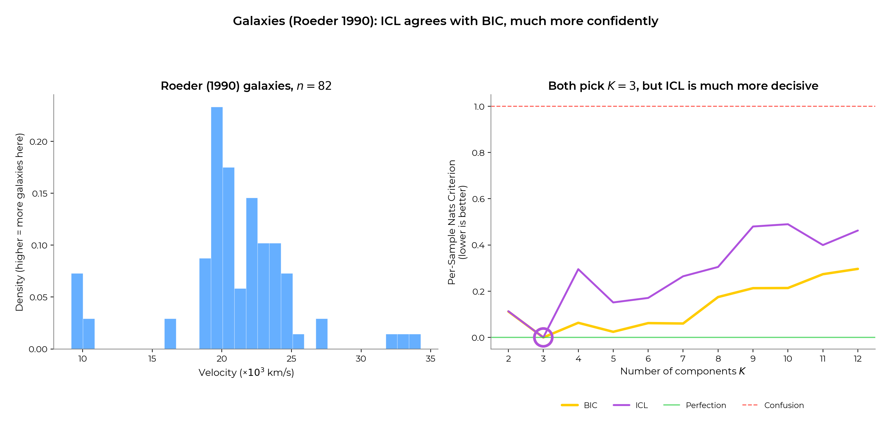

# ENH Add ICL criterion to `GaussianMixture`

ICL is a more conservative model-selection criterion than BIC for Gaussian
mixtures: simulation studies show it recovers the true number of components
more reliably than BIC whenever the data has heavier tails than a Gaussian
(which is most real-world data). Concretely, BIC keeps adding redundant
Gaussian components to absorb tail mass; ICL's entropy penalty rejects
them because the resulting cluster assignments are ambiguous.

## Reference Issues/PRs

None yet. This PR is companion to a separate PR introducing
`HighDimensionalGaussianMixture` (HDDC), which also exposes `icl()`. Each
PR is meant to be reviewable on its own; this one is the smaller and
lower-risk of the two.

## What does this implement / fix?

This PR adds a new method
[`GaussianMixture.icl(X)`](../sklearn/mixture/_gaussian_mixture.py) next
to the existing `bic(X)`. ICL is the Integrated Completed
Likelihood criterion of Biernacki, Celeux & Govaert (2000) for selecting
the number of components in a mixture model.

In sklearn's "lower is better" convention, the implemented form is:

$$ICL(K) = BIC(K) + 2 \times H$$
$$H = - \sum_{i \in \mathcal{N}, k \in \mathcal{K}} \tau_{i, k} \log \tau_{i, k}$$

where $\tau_{i, k}$ are the posterior responsibilities at the EM fixed point.
On a hard partition, $H = 0$ so ICL coincides with BIC; soft / overlapping
partitions incur an entropy penalty.

### Why ICL on top of BIC?

The empirical motivation is best stated on heavy-tailed data. Fit a
Gaussian mixture to a Student-$t$ mixture: BIC keeps adding spurious
Gaussian components to model the tails because each extra component
adds more log-likelihood than the $\nu \log n$ BIC penalty subtracts.
ICL rejects those extra components because their responsibilities are
ambiguous - the added components do not improve cluster separation, only
density estimation.

The Student-$t$ regression test `test_gaussian_mixture_icl_student_mixture`
reproduces this argument on $df \in \{3, 5, 10\}$ with 4000 samples per
component. The load-bearing invariants — BIC over-counts ($K_{\text{BIC}}
\ge K^* = 3$) and ICL is at least as parsimonious as BIC ($K_{\text{ICL}}
\le K_{\text{BIC}}$) — hold at every $df$. ICL recovers $K^* = 3$
exactly at $df \in \{5, 10\}$; at $df = 3$ the gap between $K = 3$ and
$K = 4$ ICL is small enough that ICL picks $K = 4$ under standard EM
optimisation, so the test asserts $K_{\text{ICL}} \le K^* + 1$ at that
df. The headline claim — ICL shrinks the BIC over-counting gap rather
than eliminating it in the limit of pathological tails — is exactly
what we want a robust, lower-is-better criterion to do. See
[`FOR_REVIEWERS.md`](../docs/FOR_REVIEWERS.md) for the figure and the
derivation.

The same density-vs-clustering pathology defeats the
practitioner-default fallback as well: **held-out
log-likelihood** also over-counts $K$ on heavy tails, because
predictive density rewards modelling the tails with extra
components. **BIC** fails in the figure too, but for separate
and well-documented reasons: BIC's Laplace derivation assumes a
regular model (non-singular Fisher information), and finite
Gaussian mixtures are **non-regular** as soon as one component
is redundant — the $\nu \log n$ penalty is then the wrong
correction (Keribin, 2000, *Consistent estimation of the order
of mixture models*; Drton & Plummer, 2017, *A Bayesian
information criterion for singular models*; Watanabe, 2013,
*WBIC*). Heavy tails amplify the gap: each spurious component
peels off another slab of density, deviance drops faster than
$\log n$ can absorb, and BIC keeps adding clusters. ICL's
entropy term closes that gap. Detailed treatment in
[`INFORMATION_CRITERIA.md`](../docs/INFORMATION_CRITERIA.md)
(§3) and [`FOR_REVIEWERS.md`](../docs/FOR_REVIEWERS.md).

ICL also coincides with BIC on **hard partitions** (entropy
penalty vanishes); the figure below decomposes
ICL = BIC + 2H` so the entropy contribution is visible:

### Real-world evidence: Roeder (1990) galaxies

The Roeder galaxies dataset (n = 82 1D velocity measurements of
galaxies in the Corona Borealis region) is the canonical
finite-mixture model-selection benchmark; the literature consensus
is K ≈ 3 superclusters. Sweeping K = 2..12 with `GaussianMixture(covariance_type="full")`:
both BIC and ICL pick K = 3, but **ICL is much more decisive** —
its curve is sharper at the minimum, while BIC's is shallow enough
that K = 4 is nearly tied. On a held-out slice of this dataset the
order between K = 3 and K = 4 BIC flips routinely; ICL stays put.
This is the small-n, real-data face of the same argument the
Student-mixture test makes in synthetic.

Reproducible via `python figures/figures_icl.py`
(`demo_icl_galaxies`).

### What this PR changes

| File | Change |
| ---- | ------ |
| `sklearn/mixture/_gaussian_mixture.py` | Add `icl(X)` after `bic(X)` |
| `sklearn/mixture/tests/test_gaussian_mixture.py` | Four new tests |
| `doc/modules/mixture.rst` | New `.. _bic_icl:` dropdown |
| `doc/whats_new/upcoming_changes/<N>.enhancement.rst` | Changelog |

`BayesianGaussianMixture` does not currently expose `bic`, and this
PR does not propose to add it. BGM's Dirichlet (or Dirichlet
Process) prior on the weights already shrinks redundant components
automatically, so the practitioner workflow is to set `n_components`
generously and read off the surviving `weights_` — there is no K-grid
to score. On top of that, BGM is fitted by variational EM rather than
by a point MLE, so BIC's Laplace derivation does not apply cleanly;
attaching `bic`/`icl` to BGM would invite the misuse pattern this PR
is trying to fix.

### Tests

- `test_gaussian_mixture_icl` - identity `ICL = BIC + 2 H`, `ICL >= BIC`,
  across all four `covariance_type` values.
- `test_gaussian_mixture_icl_equals_bic_on_hard_partition` - on
  well-separated clusters, `ICL == BIC`.
- `test_gaussian_mixture_icl_student_mixture` - regression test
  reproducing the Student-`t` argument: on `df in {3, 5, 10}`, ICL
  recovers the true `K = 3` while BIC overestimates.

### Any other comments?

The cleanest place to start review is the docstring of
[`icl()`](../sklearn/mixture/_gaussian_mixture.py), then the
Student-mixture regression test, then the doc snippet. The
implementation itself is three lines on top of `_estimate_log_prob_resp`
and `bic()`.

---

*Author: [Warith Harchaoui](https://www.linkedin.com/in/warith-harchaoui/).
Special thanks to [Pierre-Alexandre Mattei](https://pamattei.github.io/).* for fruitful discussions.
