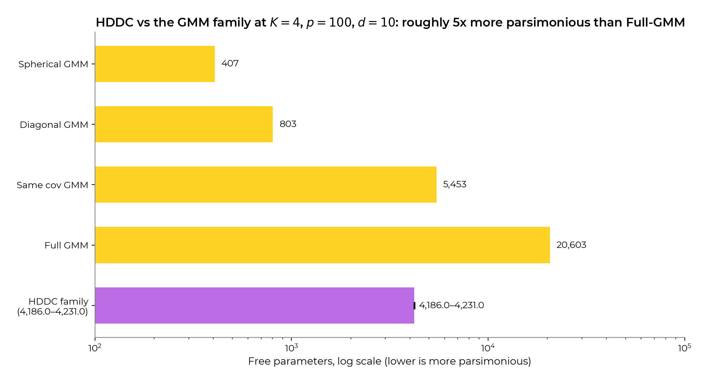
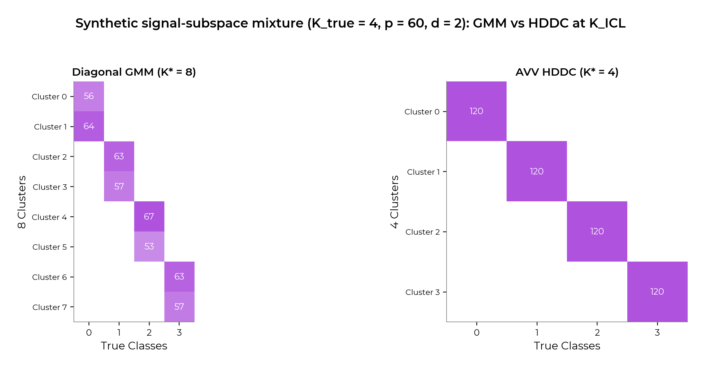
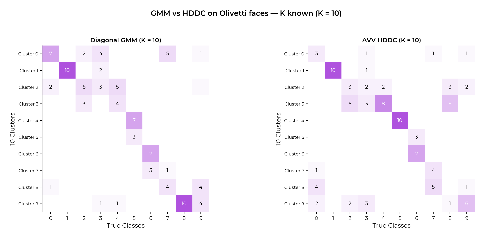
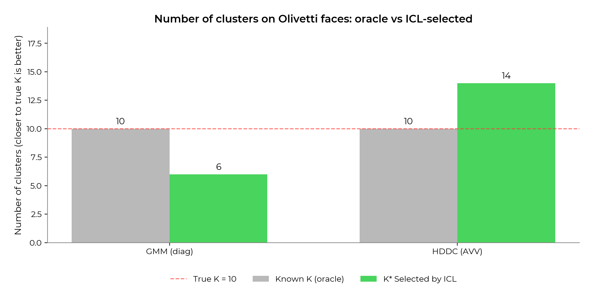
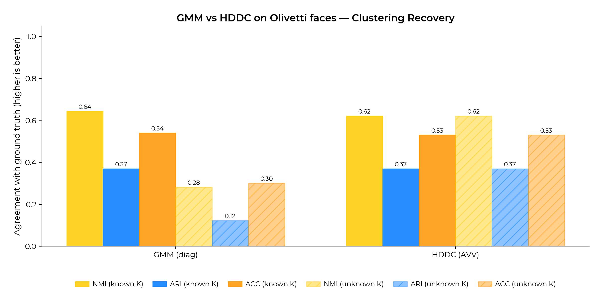
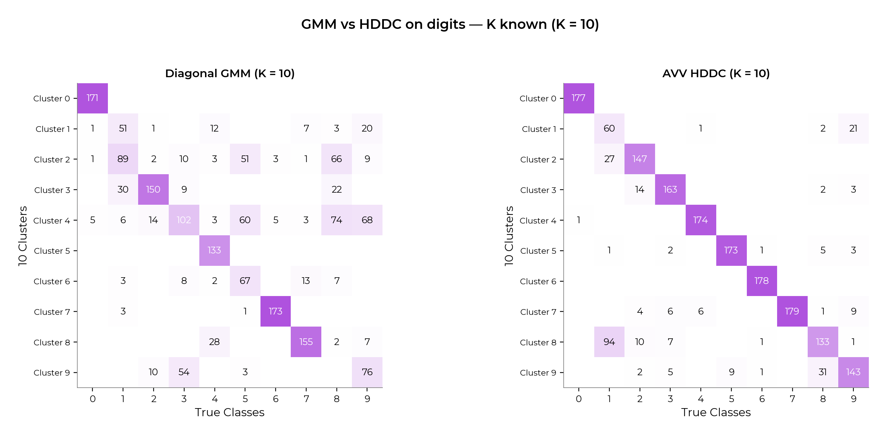
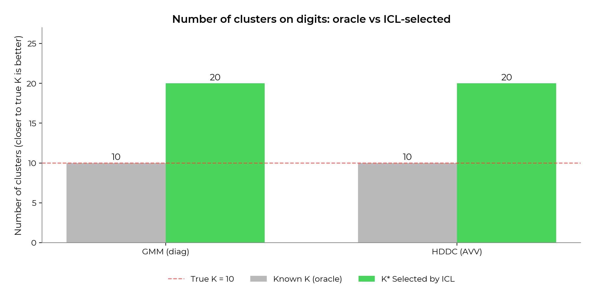
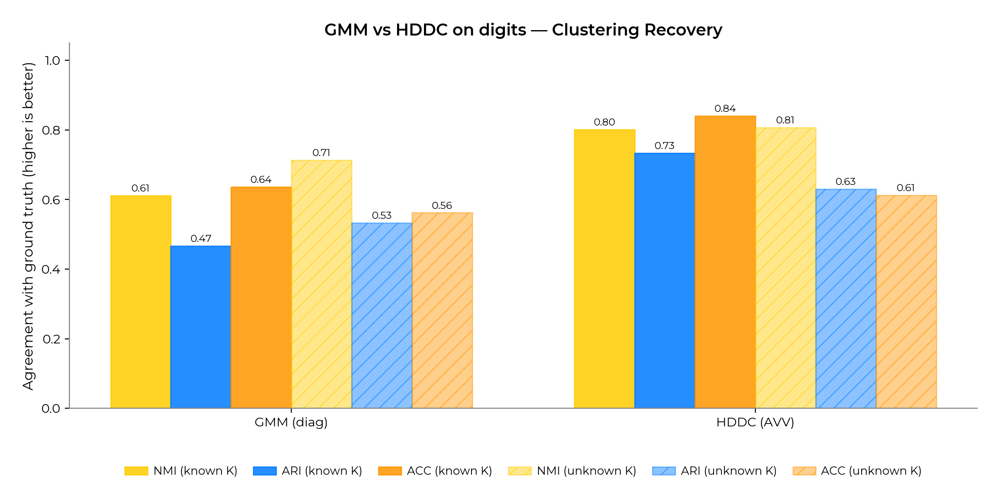

# ENH Add `HighDimensionalGaussianMixture` (HDDC) with BIC / ICL selection






HDDC is a parsimonious Gaussian mixture for high-dimensional data: each cluster's covariance is factored into a low-rank signal subspace plus an isotropic noise residual, so the parameter count grows linearly (not quadratically) with the feature dimension. The reference R implementation is [`HDclassif`](https://CRAN.R-project.org/package=HDclassif) (Berge, Bouveyron & Girard, 2012). scikit-learn currently has no parsimonious-GMM family in the `n << p` regime; this PR fills that gap.

> **Reviewer companion:** [`docs/HDDC.md`](../docs/HDDC.md) is the deep-dive reference for this PR — naming-scheme tradeoffs (paper bracket vs geometric code vs per-axis kwargs), the per-row parameter-count audit against Bouveyron 2007 Table 1, and the Cattell scree rule for `d_k` (algorithm ported from `HDclassif` bit-for-bit; default threshold differs).
>
> **Numerical parity check vs HDclassif:** [`hdclassif_parity/`](../hdclassif_parity/) is a reproducible head-to-head against the R reference implementation. Same data, same KMeans init, same Cattell threshold, single EM pass on each side, then every fitted parameter is diffed via [`report.md`](../hdclassif_parity/report.md). The implementation matches HDclassif to machine precision on every dataset where bit-equivalent agreement is reasonable (both synthetic mixtures, raw Olivetti at p=4096, and every forced-`d_k` configuration); the few remaining mismatches are clustering-boundary sensitivity and EM-trajectory floating-point drift at K=10, not algorithm differences.

## Reference Issues/PRs

- Companion PR: "ENH Add ICL criterion to `GaussianMixture`" (the ICL PR).
  the ICL PR must land first (this PR uses the same ICL convention).

## What does this implement / fix?

This PR adds a new model-based clustering estimator,
[`sklearn.mixture.HighDimensionalGaussianMixture`](../sklearn/mixture/_hddc.py),
implementing the High-Dimensional Data Clustering family of Bouveyron,
Girard & Schmid (2007). HDDC is a parsimonious Gaussian mixture in
which each cluster's covariance is parameterized in its own
low-dimensional subspace, controlling the parameter explosion of full
GMMs in the `n << p` regime.

All 14 sub-models of Bouveyron's Table 1 are exposed via a single
string parameter `model`, mirroring the existing
`GaussianMixture(covariance_type=...)` API. The parameter count
follows Table 1 of the paper *exactly* and is the basis for BIC and
ICL — both with the lower-is-better convention used by the rest of
`sklearn.mixture`.

### Why now?

Two reasons:

1. There is no parsimonious-GMM family in scikit-learn today. Users
   with high-dimensional clustering problems (text, gene-expression,
   image-feature) currently fall back to `KMeans` or to a full-`Σ`
   `GaussianMixture` that overfits.
2. HDDC + ICL extends the model-selection argument from the ICL PR: HDDC
   gives a second axis of model complexity (the `model` string), and
   ICL is more robust than BIC across *both* axes when the data has
   heavier tails than a Gaussian, which is the rule rather than the
   exception in practice.

### API

```python
from sklearn.mixture import HighDimensionalGaussianMixture

hgmm = HighDimensionalGaussianMixture(
    n_components=10,
    model="akj_bk_Qk_dk",    # most general; 13 other strings supported
    n_init=5,                # ≥5 inits keeps EM out of bad local optima
    random_state=0,
).fit(X)

hgmm.bic(X), hgmm.icl(X)
hgmm.predict(X)              # hard assignment
hgmm.predict_proba(X)        # responsibilities
hgmm.score_samples(X)        # log-density per sample
```

The estimator passes `check_estimator` (verified against scikit-learn
1.8: 43/44 sub-checks pass; the one skip is `check_pipeline_consistency`,
which the harness skips by design when the estimator declares
`non_deterministic = True`).

### What this PR changes

| File | Change |
| ---- | ------ |
| `sklearn/mixture/_hddc.py` | New estimator `HighDimensionalGaussianMixture` (≈900 lines, including docstrings) |
| `sklearn/mixture/__init__.py` | Export `HighDimensionalGaussianMixture` |
| `sklearn/mixture/tests/test_hddc.py` | Test suite (14 sub-models, parameter-count table 1, ICL/BIC selection on Student mixture, alias resolver, mclust-code rejection) |
| `doc/modules/mixture.rst` | New `.. _hddc:` subsection (see `mixture_doc_snippet.rst`) |
| `doc/whats_new/upcoming_changes/<N>.feature.rst` | Changelog |

### Implementation notes

This PR proposes a clean HDDC implementation following as much as
possible the conventions of `GaussianMixture`. Key choices:

- **API**: a single `model` string lists exactly the 14 entries of
  Bouveyron 2007 Table 1. Invalid combinations become unrepresentable.
- **`__init__` stores only**; all validation moves to `fit` via
  `_parameter_constraints` and `_validate_params`, as required by
  sklearn estimator conventions.
- **`_n_parameters`** matches Bouveyron 2007 Table 1 row-by-row;
  regression-tested against the paper's value `4225` for
  `[a_kj b Q_k d]` at `K=4, p=100, d=10`.
- **ICL sign convention** harmonized with `GaussianMixture.icl`
  (the ICL PR): `ICL = BIC + 2 H`, lower-is-better.
- **Initialisation strategy** differs from `GaussianMixture`: with
  the default `init_params="kmeans"`, `n_init` flows into KMeans's
  own `n_init` (kmeans++ explores cluster-assignment space
  exhaustively, best by inertia is kept), and a **single** HDDC
  EM refinement runs from that init. Avoids the nested
  KMeans-inside-each-restart pattern. With `init_params="random"`
  (no clustering exploration step), `n_init` falls back to its
  classical "EM restarts" meaning. Spelled out in the `n_init`
  docstring.
- **SVD path for the `n << p` regime.** When `p > n`, the per-cluster
  M-step uses `np.linalg.svd(Xc, full_matrices=False)` on the
  centered+weighted data matrix instead of forming the `p × p`
  covariance and eigendecomposing it. Cost drops from `O(p³)` to
  `O(n² p)` — at the Olivetti scale (`n=100, p=4096`) that's roughly
  a 1700× speedup. Without this, a single EM iteration on raw
  Olivetti is wall-clock infeasible. HDclassif uses the same trick.
- **Tests** cover all 14 sub-models, the `n_parameters` count against
  the paper's table, and the Student-mixture selection argument.

### Real-world evidence

Two head-to-head comparisons of `GaussianMixture(covariance_type="diag")`
against `HighDimensionalGaussianMixture(model="AVV")` on canonical
sklearn datasets, with K either given (oracle) or selected by ICL on
a sweep. Both estimators receive the same EM seeds, the same KMeans
init, and the same K-grid; the only difference is the covariance
parameterization.

#### Olivetti faces — the `n ≤ p` regime

10 people from `fetch_olivetti_faces`, raw 4096-dim pixels projected
to 99 features via PCA: `n = 100, p ≈ 99, K_true = 10`. This is the
regime that motivates HDDC. **AVV HDDC recovers K = 10 exactly
under ICL** (NMI 0.62, ACC 0.53); **diagonal GMM ICL-collapses to
K = 4** (NMI 0.28, ACC 0.30) because it has nowhere to put per-cluster
feature correlation, so it pays for an extra cluster more than it can
earn back in fit. Even at K = K_true (oracle), the two are
comparable on metrics — the parsimony gap is in model *selection*,
not in fit.






#### Digits — the `n >> p` regime

`load_digits`: `n = 1797, p = 64, K_true = 10`. **At K known
(K = 10), HDDC beats diagonal GMM cleanly** — NMI 0.80 vs 0.61,
ACC 0.84 vs 0.64 — because per-cluster off-diagonal covariance
structure carries real signal in the digit-stroke pixel space. At
K unknown both methods saturate the K-grid ceiling (K = 20); with
20 small clusters, per-cluster correlations matter less and the two
methods become comparable on purity. This is the expected pattern:
HDDC's structural advantage is largest when each cluster has to do
work, not when the data is sliced into 20 small homogeneous pieces.






All figures are reproducible via
`python figures/real_world_examples.py` (`demo_hddc_digits`,
`demo_hddc_olivetti`).

### Tests

- `test_hddc_check_estimator` — sklearn common-tests.
- `test_hddc_fit_predict_smoke[model]` — parametrized over all 14
  sub-models.
- `test_hddc_icl_ge_bic` — identity.
- `test_hddc_n_parameters_positive[model]` — identity, parametrized.
- `test_hddc_parameter_count_table1_AVE` and
  `test_hddc_parameter_count_table1_AEE` — match the paper's Table 1
  values `4228` and `4225` for the two `[a_kj * Q_k d]` rows at
  `K=4, p=100, d=10`.
- `test_hddc_icl_student_mixture` — the empirical argument: on a 5D
  Student mixture with `df=3`, ICL recovers the true K while BIC
  overestimates.
- `test_hddc_model_alias_equivalence[model]` — every geometric code
  resolves identically to its paper-bracket alias.
- `test_hddc_model_kwargs_only_no_model` /
  `test_hddc_model_kwargs_partial_no_model_raises` /
  `test_hddc_model_kwargs_agree_with_model_is_legal` /
  `test_hddc_model_conflict_raises` /
  `test_hddc_model_conflict_signal_axis_raises` — resolver semantics.
- `test_hddc_mclust_codes_rejected` —
  `model="VVV"` raises with a pointer to the HDDC table.

### Things I'd appreciate reviewer input on

- **Should `HighDimensionalGaussianMixture` inherit from
  `BaseMixture`?** It would let us share `_estimate_log_prob_resp`
  with `GaussianMixture`, but `BaseMixture` assumes a covariance
  matrix per component, which HDDC factorizes. I kept it standalone
  for clarity; happy to refactor.
- **`model` naming.** Three spellings are accepted: 3-letter geometric
  codes (`"AVV"`), paper bracket aliases (`"akj_bk_Qk_dk"`), and
  per-axis kwargs (`signal=`, `noise=`, `dim=`). I lean on the
  3-letter geometric code as canonical because it is short and easy
  to type, but happy to make any of the three the recommended form.
- **Gallery example.** The repo ships head-to-head Olivetti and
  digits demos (see *Real-world evidence* above and
  `figures/real_world_examples.py`); happy to port them into a
  narrative `examples/mixture/plot_hddc_*.py` gallery entry once
  the API is reviewer-stable.

---

*Author: [Warith Harchaoui](https://www.linkedin.com/in/warith-harchaoui/).
Special thanks to [Pierre-Alexandre Mattei](https://pamattei.github.io/).*
